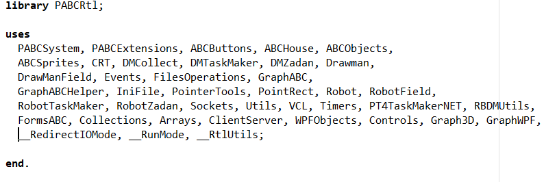

Owner: Alexander Zemlyak
Tags: Codebase

Dll-библиотека для ускорения времени выполнения “простых” программ без пользовательских uses (допускается использование пр-в имен и стандартных модулей Паскаля из самой RTL). Для использования требуется включить флажок *“Ускорять запуск из под оболочки”.*

---

На картинке можно видеть стандартные модули из библиотеки:

---

> [!NOTE] Особые стандартные модули. 1-я группа
>  Некоторые стандартные модули не входят в PABCRtl.dll, поскольку она 64-битная, а они используют нативные 32-битные библиотеки. Таковыми являются модули из следующего списка: PT4, CRT, Arrays, MPI, Collections, Core. При использовании их в программе PABCRtl.dll не загружается. *2-я группа* Если стандартные модули не входят в RTL и одновременно не входят в список исключения RTL, о котором говорилось выше, то RTL загружается. Но при этом возникает ошибка компиляции и компиляция запускается заново без использования RTL.

> [!NOTE] Как сделано так, что при явном использовании стандартных модулей из RTL их pcu-файлы не используются?
> Стандартные модули в этом случае воспринимаются как пространства имен и даже добавляются в соответствующие списки, такие как `possibleNamespaces` (см. [[Uses lists]]). Метод `CompileUnit` для них вообще не вызывается. Конечно, хотелось бы выделить логику обработки стандартных модулей из rtl в отдельный блок кода.

